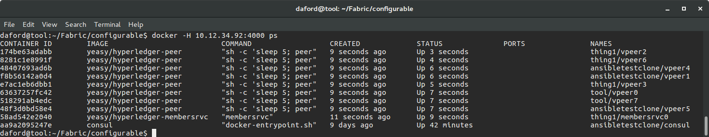
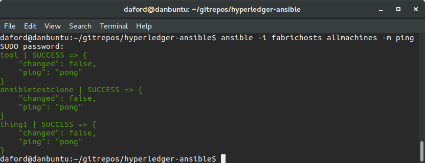
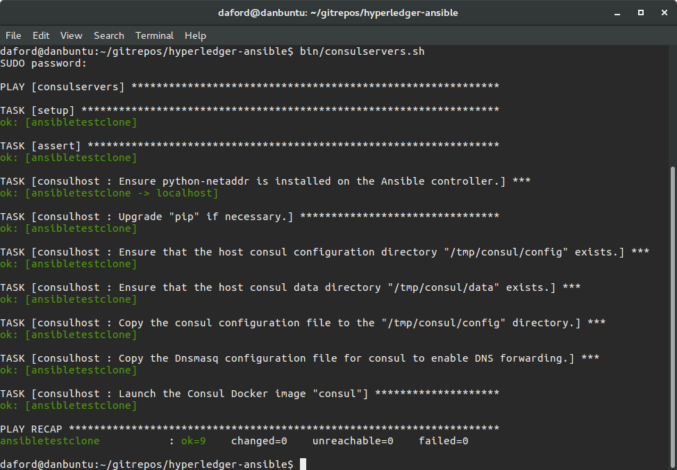
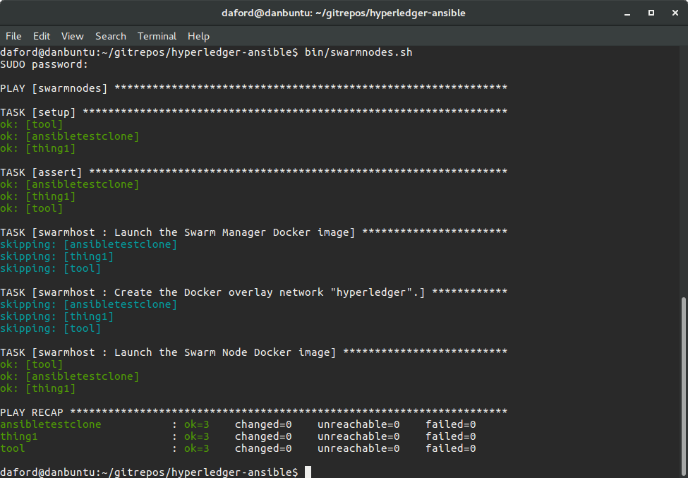
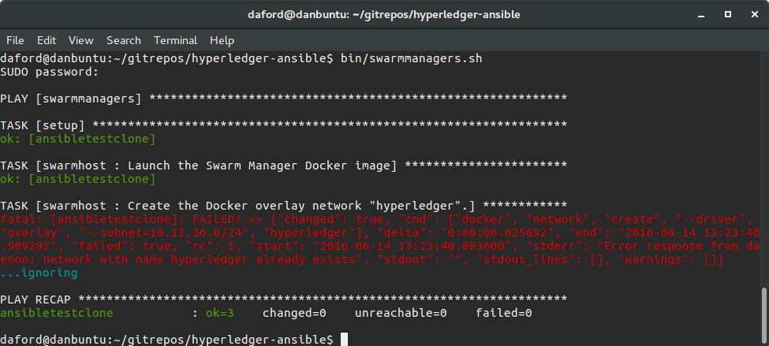
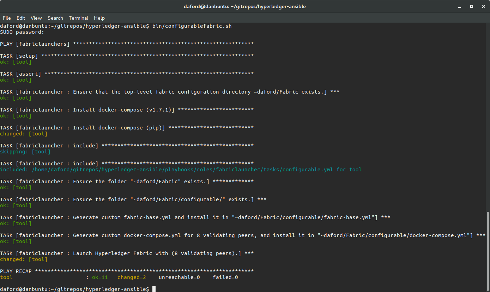
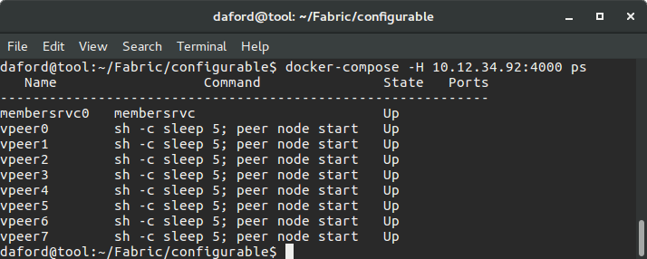
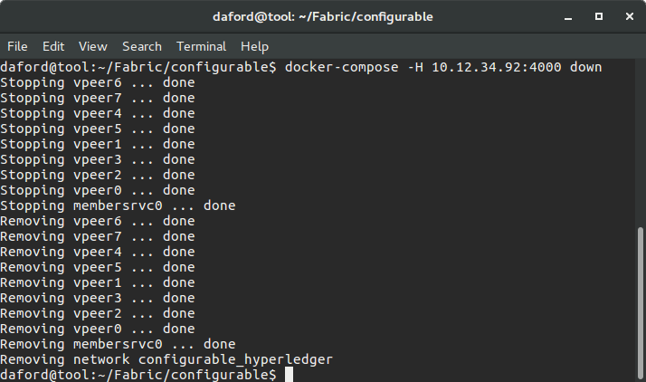
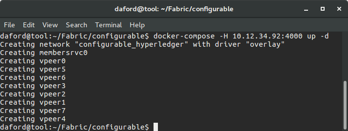

# hyperledger-ansible

The repository contains a collection of simple and easy to read [Ansible](https://www.ansible.com/) "playbooks" that provision and configure machines to develop, and run [Hyperledger](http://hyperledger.org).  In particular, the Ansible playbooks automate the creation of an instance of the [Hyperledger Fabric](https://github.com/hyperledger/fabric) using [Consul](https://www.consul.io/), [Docker](https://www.docker.com/), [Docker Swarm](https://docs.docker.com/swarm/overview/), and [Docker Compose](https://docs.docker.com/compose/).  

A screenshot of the status of an automatically provisioned, configured and launched instance of the  Hyperledger Fabric with eight validating peers running in Docker containers on three separate machines is below.  This instance was created from "scratch" on previously un-configured computers with a single command.

 

The actions of the Ansible playbooks that created this instance are configured through an inventory file of "host" computers, and a small collection of variables, with sensible defaults, that allow all aspects of a Fabric instance to be specified.  For instance, an arbitrary number of instances of Fabric "peers" can be launched across an arbitrary networked collection of hosts simply by changing the value of a single variable.  Also, the exact Docker images and the exact hosts to use, and their roles, are all configurable. The playbooks will take care of the details of automatically provisioning the various hosts with Consul (servers and clients), Docker, Docker Swarm (managers and nodes), and Docker Compose, as appropriate.  They will generate all necessary configuration files, for instance, for each Fabric instance, a custom `docker-compose.yml` file is generated from the current state of the configuration, "on-the-fly," just before the Fabric is launched on a secure [overlay network](https://docs.docker.com/swarm/networking/).  

Future extensions to the functionality of playbooks in this repository are under development and will address functions such as the automatic provisioning and configuration of a developer's workstation to write and test code for the Hyperledger code base, as well as the provisioning and configuration of Docker containers for continuous integration builds using [Jenkins](https://jenkins.io/) and other tools. 

## Hyperledger
Hyperledger is a project under the management of the [Linux Foundation](http://www.linuxfoundation.org/) that implements a type of "[permissioned Blockchain](https://en.wikipedia.org/wiki/Block_chain_(database)."

## Ansible
Ansible is an automation framework for provisioning, deploying and generally managing computers.  It differs from other frameworks (e.g., [Chef](https://www.chef.io/), [Puppet](https://puppet.com/), [Salt](https://saltstack.com/)) in that it is agent-less, meaning that it does not install software on the machines it manages, instead it performs all operations by [ssh](https://en.wikipedia.org/wiki/Secure_Shell).  This tends to simplify matters greatly, helping to make Ansible easier to deploy, learn and use.  

Ansible is designed around three organizing concepts, *inventories*, *roles*, and *playbooks*.  An inventory lists the *hosts* (computers) that Ansible will manage, and categorizes them each into one or more *groups*.  Roles specify one or more (idempotent) *tasks* to apply to specific hosts. Playbooks serve as the mapping between groups defined in the inventory, and roles (i.e., collections of tasks); for each group listed in an inventory, there is a single playbook, which is a separate file of the same name as the group.  Each playbook lists one or more roles whose tasks are to be applied to the hosts in the corresponding group.  All three are represented by simple, easy to read, text files.

Each task listed in a role corresponds directly to an [ansible module](http://docs.ansible.com/ansible/modules_by_category.html) which is (usually) a small Python program.  Each module performs a specific, well defined, operation on the host (i.e., remote) machine, but only if needed.  For example, the Ansible "[apt](http://docs.ansible.com/ansible/apt_module.html)" module will install software using the [Advanced Packaging Tool](https://en.wikipedia.org/wiki/Advanced_Packaging_Tool) (apt), but will only do so if the software is not already installed.

Ansible operates by using `ssh` and `scp` to copy the code for a module (task) to the host computer.  That code is then executed, potentially with sudo privileges, and allowed to examine the state of the machine.  If there is something to do, like install software, it does so, if not, it simply exits.  In either case, a module returns a JSON object back, as text through stdout, over the network to Ansible running on the control machine with a summary of the changes it did, or did not, make.  

# Getting Started

## A Tour of the Repository

The layout of the repository generally conforms to Ansible [best practices](http://docs.ansible.com/ansible/playbooks_best_practices.html#directory-layout), with some slight modifications to create better grouping and reduce clutter.

The repository is organized around an inventory file named `fabrichosts`, and two directories, [group_vars](group_vars/README.md), and [playbooks](playbooks/README.md).  

### fabrichosts

The hosts (computers) that Ansible will manage are listed in the `fabrichosts` file. The file contains groups such as `dockerhosts` and `swarmmanagers`.  When you examine the file you should see that virtually all of the hosts are listed under the `dockerhosts` section of the file.  This indicates that all machines will be provisioned and configured by Ansible to support the  hosting of Docker containers.  You will also notice that fewer machines are listed under the `swarmmanagers` section, indicating that fewer hosts are assigned the role of a Docker "[swarm manager](https://docs.docker.com/swarm/overview/)."  For those that are, Ansible will take care of provisioning and configuring them to participate as swarm managers.

### group_vars

The [group_vars](group_vars/README.md) directory contains files that define the values of variables used to configure the rest of the Ansible playbooks.  The file `group_vars/all.yml`, for instance, defines variables and their values that are available, by default, in all playbooks.  The playbooks directory contains the playbooks that match the groups defined in the `fabrichosts` inventory file.
   
   Examining the `all.yml` file is a good place to start to understand the scope of what the playbooks can accomplish and how extensively their actions can be configured.  
   
### playbooks

   For each "group" in the `fabrichosts` file there is a YAML formatted file with the same name in the `playbooks` directory, each one is a "playbook" for the hosts belonging to the group with the same name.  Each playbook contains a list of one or more "roles" that will be applied, in sequence, to each host in the corresponding group.  
  
   The `playbooks` directory has a sub-directory called `roles`. This sub-directory contains a collection of directories, one for each role.  The names of those directories are, by convention, the names of the roles.  When a playbook references a role, it lists the name of one of these directories.  For example, the role `dockerhost` included in the playbook `playbooks/dockerhosts.yml` references the directory `playbooks/roles/dockerhost` (note that the names of the playbooks and the names of roles do not usually match so directly).
  
   Each role sub-directory has a very specific [format](http://docs.ansible.com/ansible/playbooks_best_practices.html#directory-layout) that is expected by Ansible.  Not all of the sub-directories of a role are used or required by all roles, so you will see that some are omitted in this repository where they are superfluous.  Each role's directory has a `tasks` sub-directory, which must include a file named `main.yml` (you will see the convention of having a file called main.yml used elsewhere in Ansible).  It is this file that contains the "tasks" that define the role.
  
   Each task definition has a "name" which is a text string that describes the purpose of the task.  These strings are printed on the console in sequence as Ansible processes each task, making it easy to follow Ansible's progress.  As mentioned above, each task is implemented by an [ansible module](http://docs.ansible.com/ansible/modules_by_category.html).  If you look in `playbooks/roles/dockerhosts/tasks/main.yml` you'll see a sequence of named tasks that provision a host to allow it to host Docker containers.  
   
   
## Installation and Configuration
There are a number of steps required to use the playbooks.

### Install Ansible V2.1.0

The Ansible playbooks in this repository **REQUIRE** at least version 2.1.0 of Ansible.  This requirement is in place because they leverage Ansible modules for interfacing with Docker that were only introduced in V2.1.0 (e.g., [docker_container](http://docs.ansible.com/ansible/docker_container_module.html) and [docker_service](http://docs.ansible.com/ansible/docker_service_module.html)).  At the time this text was originally written (June 2016), this version of Ansible is not generally available in the Linux Distro repositories, requiring installation of Ansible from source.  This is not difficult and mostly involves cloning the [Ansible github repository](https://github.com/ansible/ansible), and setting some environment variables.

1. Clone the ansible github repository.

        git clone git://github.com/ansible/ansible.git --recursive
  
1. Change directory into the newly cloned repository.

        cd ./ansible
   
1. Set up environment variables.

        source ./hacking/env-setup

1. Install pip.

        sudo easy_install pip
   
1. Install Python modules for Anisble.
 
        sudo pip install paramiko PyYAML Jinja2 httplib2 six

1. Clone Ansible submodules.

        git submodule update --init --recursive

To update ansible from github as necessary.

        git pull --rebase

These are useful additions to one's ~/.bashrc file (where `GIT_REPOS_HOME` is the parent of the cloned Ansible github repository).

         export ANSIBLE_HOME=$GIT_REPOS_HOME/ansible
	     export PATH=$ANSIBLE_HOME/bin:$PATH
	     export PYTHONPATH=$ANSIBLE_HOME/lib
         source $ANSIBLE_HOME/hacking/env-setup -q

### How to prepare host computers to support management by Ansible

Basically, you need to install the [OpenSSH](http://www.openssh.com/) Server, and provide the public ssh key of the user that Ansible will use when it remotely logs into the host. 

1. Install the OpenSSH Server (On a Mac, you need to go to System Preferences->Sharing and enable "Remote Login" for all users).
        
        sudo apt-get install openssh-server  
            
1. Install python for apt

        sudo apt-get install python-apt
        
1. Reboot

        sudo reboot

1. If necessary, create a user with sudo privileges on the new machine that Ansible will use to to ssh to login to the machine. (e.g., for the user "daford")

        sudo adduser daford
        sudo usermod -a -G sudo daford
  
1. Copy the user's public SSH Key to the new host.  This only populates the `.ssh/authorized_keys` file with the `id_rsa.pub` value.  It doesn't create any other files on the host.  For example, for the user "daford" on a host with ip address 10.12.34.100 issue this on the Ansible controlling machine.

        ssh-copy-id -i ~/.ssh/id_rsa.pub daford@10.12.34.100

1. Edit the Ansible `fabrichosts` file to include the new machine.

### Use Ansible to "ping" the hosts to check for connectivity.

An easy way to test of things are configured correctly is to "ping" the hosts.

        ansible -i fabrichosts allmachines -m ping

# Customize The Hyperledger Fabric Deployment

The playbooks and the roles they reference provide the basic specification of how to provision and configure a system to run a distributed instance of Hyperledger over a collection of different hosts.  To enable this functionality, additional configuration is required to specify the exact hosts that will participate, and their roles in the network. This is accomplished by editing the `fabrichosts` file.  Also, the characteristics of the Hyperledger Fabric itself needs to be specified, for instance, the exact Docker images to be used for the peers, and the member service, as well as their number.  This configuration will require editing the `group_vars/all.yml` file; the variables that require customization are documented in the [README.md](group_vars/README.md) in the `group_vars` directory.

# Using the playbooks

After the `fabrichosts` and `group_vars/all.yml` files have been customized, the playbooks can be executed to provision, configure and launch an instance of the Hyperledger Fabric on a distributed collection of networked hosts. 

## Running a playbook

To actually execute a playbook one uses the command `ansible-playbook` and provides the hosts file and playbook file to use.  For example, to provision the hosts to support Docker:
    
        cd hyperledger-ansible
        ansible-playbook -i fabrichosts playbooks/dockerhosts.yml

## Starting the Fabric
   
A number of shell scripts have been prepared to act as shortcuts to invoking Ansible with various playbooks.  They reside in the `bin` directory.  When the `fabrichosts` file is property customized one can provision them for Docker with:

        cd hyperledger-ansible
        bin/dockerhosts.sh
        
at which point Ansible will prompt you for the "`SUDO password`" of the user on the host (remote) machine. 

_Note: There is currently a bug in the installation of "docker-py."  It is used by Ansible to interface with the Docker daemon on the host machine.  It needs to be installed on the host machine, but on some machines this installation results in an error, the exact problem is not clear.  In that case, that particular machine cannot be provisioned by Ansible and will need to be omitted from participation in the Fabric.  This problem is being actively investigated.  Unfortunately, currently, there is no workaround._ DAF

1. Configure the Consul servers (Note, there is also a playbook/shell script to provision and configure Consul clients `bin/consulclients.sh`):

        bin/consulservers.sh
   
1. Provision and configure the Docker Swarm nodes:

        bin/swarmnodes.sh
           
1. Provision and configure the Docker Swarm managers:

        bin/swarmmanagers.sh
 

Note in the screenshot above how Ansible attempted to create the "Docker overlay network" but this resulted in an "error."  The reason is that the overlay network has already been created, so there's nothing to do.  It would be better if an error was not reported, but this is not a problem, we simply ignore the response.
1. Bring up the Fabric, by default this will launch eight (8) validating peers and one member service:

        bin/configurablefabric.sh
 

Alternatively, a top-level playbook that combines the four other playbooks in the appropriate sequence is `playbooks/site.yml`.  This playbook will do everything discussed above from provisioning hosts to support Docker to launching the Fabric instance.  It can be invoked with:

        bin/fabric.sh

By default, this will bring up the member service and eight validating peers on the hosts configured in `fabrichosts`.

### Managing the Fabric

#### Docker Swarm

With the Fabric now running, one can list the status of the various peers, and their assignments to the  different hosts participating in the swarm by directly accessing the swarm manager.  The "same"  `ps` command to Docker Compose doesn't list the status and assignments of the entire swarm.

        docker -H <ip of swarmmanager>:4000 ps
        

The following will display information about the hosts in the Docker Swarm.  This will list the hosts that the swarm manager knows about.  This is useful to double-check that the swarm nodes are known to the swarm manager. You should see each one listed with assorted details.

        docker -H <ip of swarmmanager>:4000 info
#### Docker Compose        
To use Docker Compose to control the swarm, login to the host listed in `fabricchosts` in the `fabriclaunchers` group and change directories to the `~/Fabric/configurable` directory.  This is where the custom generated `docker-compose.yml` file is placed by Ansible; Docker Compose will look for that file in the working directory.  

        cd ~/Fabric/configurable
#### Docker Compose ps
The following will list of the status of the peers:

        docker-compose -H <ip of swarmmanager>:4000 ps
       
        
#### Docker Compose down
The following will stop the containers running the Fabric on the Docker Swarm:

        docker-compose -H <ip of swarmmanager>:4000 down
    

#### Docker Compose up
The Fabric can be re-launched from the previously generated `docker-compose.yml` file with:

        docker-compose -H <ip of swarmmanager>:4000 up -d
     

#### Docker Compose logs
The logs of the Fabric peers can be printed with: 

        docker-compose -H <ip of swarmmanager>:4000 logs
The logs can be "tailed" (printed continuously as the peers print to the log) with:

        docker-compose -H <ip of swarmmanager>:4000 logs -f
#### Docker Compose down for other configurations
To bring down the default "noops" fabric with four hosts, which will be launched by default if the `hl_fabric_type` variable is not set to `configurable`, log into the Fabric launcher host and issue:

       cd ~/Fabric/behave_4_noops
       docker-compose -H <ip of swarmmanager>:4000 -f docker-compose-4-consensus-noops.yml down
# Troubleshooting

## Cowsay

Cows:  If you see a cow with a voice bubble in the console like this: 

             -------------------------------------------------------------
            < TASK [dockerhost : Create the "docker" group if necessary.] >
             -------------------------------------------------------------
                \   ^__^
                 \  (oo)\_______
                    (__)\       )\/\
                        ||----w |
                        ||     ||
            
            ok: [thing1]

you're having an "Ansible experience."  This is easily suppressed by setting the environment variable `ANSIBLE_NOCOWS=1`  like this:

        export ANSIBLE_NOCOWS=1

## "Unable to lock the administration directory (/var/lib/dpkg), is another process using it?"
If you see something like this:

    fatal: [ansibletestclone] : FAILED! => {"changed": false, "failed": true, "msg": "'/usr/bin/apt-get dist-upgrade' failed: E: Could not get lock /var/lib/dpkg/lock - open (11: Resource temporarily unavailable)\nE: Unable to lock the administration directory (/var/lib/dpkg/), is another process using it?\n", "stdout": "", "stdout_lines": []}

It usually means that the host is updating the list of available software installation packages and has a lock on the process.  One of the things the playbooks do is to also update the available software installation packages to make sure that the appropriate versions are available and installed, hence the conflict.  This is more likely to be encountered shortly after a machine has booted.  Simply wait and try again later when the host has completed the process.
